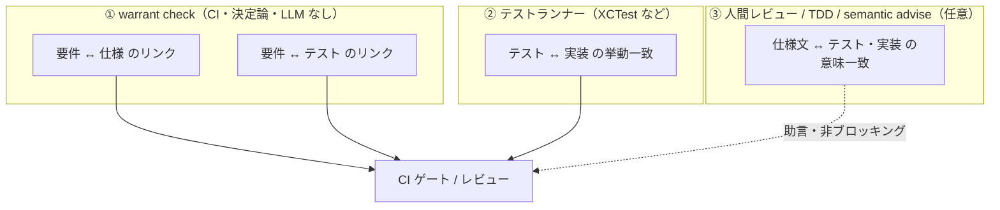
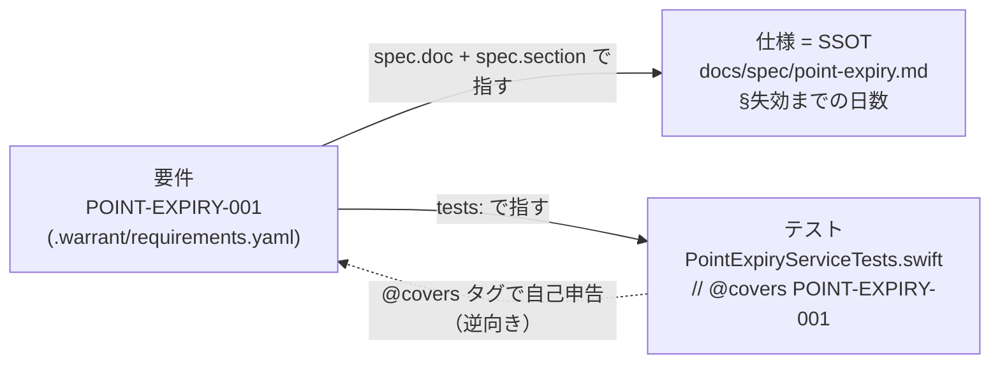
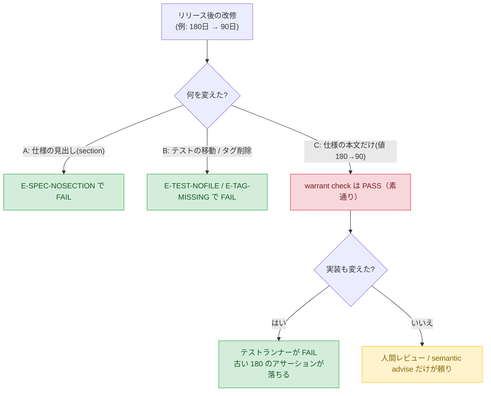
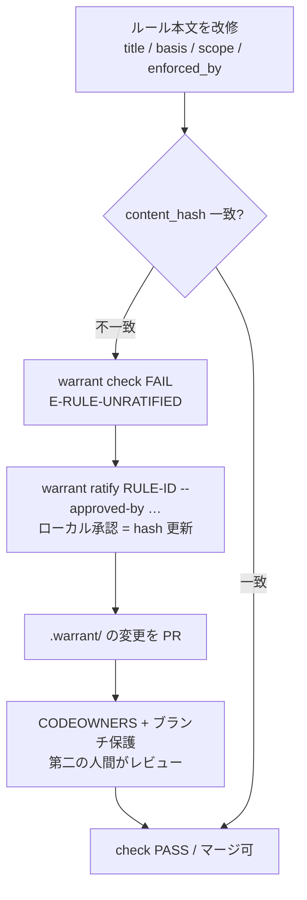

# 整合性モデルと運用思想 — warrant が「何を」守り「何を」守らないか

このドキュメントは、warrant を実プロジェクトに導入・運用する人が「要件・仕様・テストの整合性を、warrant が**どこまで**機械的に保証してくれるのか」を誤解なく理解するためのものである。warrant に過剰な期待（仕様とテストの意味が一致していることの自動証明）を寄せると失望し、逆に役割を正しく理解すれば、大規模・多人数のコードベースでこそ効く統制になる。

結論を最初に述べる。**warrant が守るのは「リンクの構造的整合性」であって、「仕様文の内容とテストの内容の意味的一致」ではない。** 整合性は warrant 単体では完結せず、テストランナー・人間レビューとの三者分業で保たれる。

## 中心思想：リンクを守る。意味は守らない

warrant の `check` は決定論的ゲートであり、判定に LLM 推論を持ち込まない（`.warrant/constitution.md` の決定性ゲートの原則）。したがって `check` ができるのは「ファイルが在るか」「タグが在るか」「ID が一致するか」といった、**機械が一意に判定できる構造の検証**に限られる。仕様書の散文が語る意味と、テストコードが検証する挙動が「同じことを言っているか」は、原理的に決定論では判定できないため、warrant の守備範囲外に置かれている。

この割り切りは弱点ではなく設計判断である。意味判定を諦める代わりに、warrant は「リンクが切れていないこと」を**毎回ゼロ計算で・キャッシュなしで・同じ答えで**保証する（`docs/spec/check.md` 「判定の決定性」）。ゲートが決定論であることは、CI が壊れたとき原因が常に説明可能であることを意味する。

## 三者の分業

整合性は3つのレイヤーが分担して守る。warrant はそのうち1枚だけを担当する。



| 守りたい整合性 | 担保するもの | warrant の役割 |
|---|---|---|
| 要件 ↔ 仕様（リンク） | `warrant check`（`E-SPEC-*`） | 機械保証 |
| 要件 ↔ テスト（リンク） | `warrant check`（`E-TEST-*` / `E-TAG-*`） | 機械保証 |
| テスト ↔ 実装（挙動） | テストランナーの実行 | 範囲外（テストランナーが担う） |
| 仕様文 ↔ テスト・実装（意味） | 人間レビュー + テクニック + semantic advise | 可視化のみ。自動判定はしない |

## リンクの構造：双方向で宣言が一致して初めて PASS

warrant の整合性検査の肝は、**要件側とテスト側の双方が同じ ID を指していないと通らない**点にある。片方を消すと壊れる。



要件は `tests:` でテストファイルを指し、テストファイルは `@covers <ID>` で要件 ID を逆向きに自己申告する。この双方向リンクが一致しない場合、`check` は `E-TAG-MISSING`（要件はテストを指すがタグが無い）または `E-TAG-ORPHAN`（タグはあるが要件が未登録）で FAIL する。

## 具体例：ポイント失効機能

言語非依存の仕組みだが、ここでは iOS（Swift / XCTest）を例にする。1つの要件を4ファイルで表現する。

```yaml
# .warrant/config.yaml
spec_root: docs/spec
test_globs:
  - "UsapoAppPackage/Tests/**/*Tests.swift"
tag: "@covers"          # テスト側の自己申告タグ（設定可）
id_pattern: '[A-Z][A-Z0-9]*(?:-[A-Z0-9]+)+'
derived_globs:
  - ".warrant/traceability.generated.md"
```

```yaml
# .warrant/requirements.yaml
requirements:
  - id: POINT-EXPIRY-001
    title: 最終利用から180日でポイントが失効する
    status: active
    spec:
      doc: docs/spec/point-expiry.md
      section: "### 失効しきい値: 180日"   # ← 値を見出しに含めるのがコツ（後述）
    tests:
      - UsapoAppPackage/Tests/PointFeatureTests/PointExpiryServiceTests.swift
```

```markdown
<!-- docs/spec/point-expiry.md（SSOT。一次情報） -->
# ポイント失効仕様

### 失効しきい値: 180日
最終利用日（lastUsedAt）から 180 日経過したポイントは失効する。
判定は失効バッチ実行時刻（now）を基準に行う。
```

```swift
// UsapoAppPackage/Tests/PointFeatureTests/PointExpiryServiceTests.swift
import XCTest
@testable import PointFeature

// @covers POINT-EXPIRY-001
// 仕様: docs/spec/point-expiry.md#失効しきい値-180日
final class PointExpiryServiceTests: XCTestCase {
    func test_180日経過で失効する() {
        let lastUsed = Date(timeIntervalSince1970: 0)
        let now = lastUsed.addingTimeInterval(180 * 24 * 60 * 60)
        XCTAssertTrue(PointExpiryService.isExpired(lastUsedAt: lastUsed, now: now))
    }
}
```

このとき `warrant check` は要件 `POINT-EXPIRY-001` について次を独立に検査する（`internal/check/check.go`）。いずれか1つでも欠けると CI が落ちる。

| 検査 | 実装箇所 | 失敗時のコード |
|---|---|---|
| `spec.doc` が実在する | `check.go:147` | `E-SPEC-NOFILE` |
| `spec.doc` が派生物でない | `check.go:140` | `E-SPEC-DERIVED` |
| `spec.section` の文字列が doc 内に部分一致で存在する | `check.go:157`（`strings.Contains`） | `E-SPEC-NOSECTION` |
| active な要件にテストが1件以上ある | `check.go:184` | `E-NOTEST` |
| 宣言したテストファイルが実在する | `check.go:213` | `E-TEST-NOFILE` |
| テストが `@covers <ID>` を自己申告している | `check.go:227` | `E-TAG-MISSING` |

## 改修で整合が崩れる3シナリオ：2つは捕まり、1つは素通りする

リリース後に「180日 → 90日」へ仕様変更が入った場合、何が起きるか。これが warrant の守備範囲を最もよく表す。



### シナリオA：仕様の見出しを変えた → 捕まる
`spec.section` に指定した文字列が doc 内から消えると `E-SPEC-NOSECTION` で FAIL する（`check.go:154-164`）。要件が指していた仕様の足場が消えたことを機械検知できる。

### シナリオB：テストを移動した / タグを消した → 捕まる
`tests:` のパスが実在しなくなれば `E-TEST-NOFILE`、ファイルは残ってもタグを消せば `E-TAG-MISSING`（`check.go:219-233`）。テストへのリンクが切れた要件を機械検知できる。

### シナリオC：仕様の本文だけ書き換えた → 素通りする
仕様書の本文を「180 日」から「90 日」に書き換えても、見出し（section 文字列）が同じでテストファイルとタグが健在なら、`warrant check` は **PASS する**。warrant は仕様の散文とテストのアサーション値（180）を突き合わせていない。要件には content_hash が無く、本文比較ロジックも存在しないためである。これは決定性ゲートの設計思想からくる**意図的な非対応**である。

## では素通りする C をどう守るか

warrant 単体は C を守らない。実運用では次の4つで埋める。

1. **テストランナーが「テスト↔実装」を守る。** 仕様を90日にして実装も90日に直すと、180日前提の古いテストがランタイムで FAIL する。「仕様変更を実装に入れたのにテストを直し忘れた」は warrant ではなく通常のテスト失敗として CI に出る。warrant が守るのはリンク、実装追従はテストランナーの仕事。
2. **`spec.section` の粒度を上げ、値を見出しに含める。** 上の例で見出しを `### 失効しきい値: 180日` としておくと、180→90 の改修時に見出しも変わり、シナリオA の経路で `E-SPEC-NOSECTION` が発火する。本文ドリフトを見出しドリフトに変換して機械検知する運用テクニックである。
3. **`@covers` タグを人間のチェックポイントにする。** テスト作者が「このテストは POINT-EXPIRY-001 を証明する」と明示宣言する行為が、レビュー時に「本当に証明できているか」を問う起点になる。テスト冒頭に仕様値をコメント引用しておくとレビュアーが突き合わせやすい。
4. **semantic advise（任意・非ブロッキング）で意味ドリフトを助言する。** `kind: semantic` と `semantic_command` を設定すると、「仕様は90日だがテストは180日を主張」を advisory として指摘できる。ただし `warrant advise` は常に exit 0 でゲートにはならない（`docs/spec/advise.md` の不変条件「常に exit 0 で終了する」）。人間レビューの補助である。

## 司法軸と立法軸：改修時の挙動が根本的に違う

ここまでは要件（司法軸）の話である。ルール（立法軸）は改修時の挙動が異なるため、混同しないこと。

| 改修対象 | content_hash | 改修時の `check` の挙動 |
|---|---|---|
| 要件（司法軸 / requirements.yaml） | **無い** | リンクの存在のみ再検証。本文変更には反応しない |
| ルール（立法軸 / rules.yaml） | **有る**（id/title/status/basis/scope/enforced_by が対象） | 本文を変えると hash 不一致で FAIL し、再承認を強制する |

ルールを改修すると content_hash が不一致になり `E-RULE-UNRATIFIED` で FAIL する（`internal/authority`）。復旧には再 ratify が必要で、さらに `.warrant/` の変更に第二の人間レビューが乗る。これが「統治ルールの変更には機械的な再承認を強制する」立法軸の本領である。



注意すべき盲点が1つある。content_hash の入力は `basis`（"constitution.md#anchor" という**ポインタ文字列**）であって、constitution の散文そのものではない。憲法本文だけを書き換えてポインタが変わらなければ hash は反応せず、再 ratify は走らない。これを塞ぐには、根拠を改訂したら basis のアンカー名も変える規律を運用で持つ必要がある。

ローカルの ratify だけでは「第二の人間が実際にレビューした」ことは担保されない。`docs/spec/ratify.md` は次のように明記している。

> `ratify` が更新する `content_hash` は「ローカルで人間が承認した」という記録にすぎない。第二の人間によるレビューを担保するため、`.github/CODEOWNERS` と GitHub のブランチ保護で `.warrant/` の変更にオーナーレビューを必須化する。

したがって立法軸を運用する前提として、`.warrant/`（および統治対象に応じて `.claude/` 等）への CODEOWNERS とブランチ保護の設定が必要になる。

## 運用ガイドライン

- **要件は「ファイル構造」ではなく「振る舞い」単位で宣言する。** リファクタでファイルが動くたびにリンク更新の雑用が増えるのを避けるため、テストのパスではなく振る舞いに対応づける。大規模・多人数では requirements レジストリをモジュール別に分割し（`warrant check --registry`）、中央1ファイルの更新衝突を避ける。
- **`spec.section` に検証可能な値を含める。** しきい値・上限・状態名など、改修されたら見出しも変わるべき値を見出しに書くことで、本文ドリフトを `E-SPEC-NOSECTION` に変換する。
- **`@covers` 欠落を補助ツールで促す。** タグは自己申告のため、Lint や PR ボットで「新規テストにタグが無い」を警告すると規律が保てる。
- **semantic は「落とす」ためでなく「気づく」ために使う。** `advise` は非ブロッキングであることを前提に、意味ドリフトの早期発見に用いる。ゲートにはしない。

## warrant の貢献の正体

warrant の本当の貢献は「仕様とテストの意味が一致していることを自動証明する」ことではない。**リンクを明示し機械検証することで、ドリフトをレビュー可能な状態に保つ**ことである。孤立した要件・裏付けの無いテスト・切れたリンクを CI で確実に落とす。整合性の最後の一マイル（仕様文の意味）は、テストランナーと人間レビューが引き続き担う。この分業を正しく理解することが、warrant を現実的に運用する鍵である。

## 参照

- `docs/spec/check.md` — 司法ゲートの不変条件と違反コード一覧
- `internal/check/check.go` — 判定ロジックの実装（本ドキュメントの行番号引用元）
- `docs/spec/authority.md` — 立法軸（ルール・根拠・チェックの三者リンク）
- `docs/spec/ratify.md` — 承認と二重化の限界
- `docs/spec/advise.md` — semantic advisory の不変条件（非ブロッキング）
- `.warrant/constitution.md` — 決定性ゲートの原則
