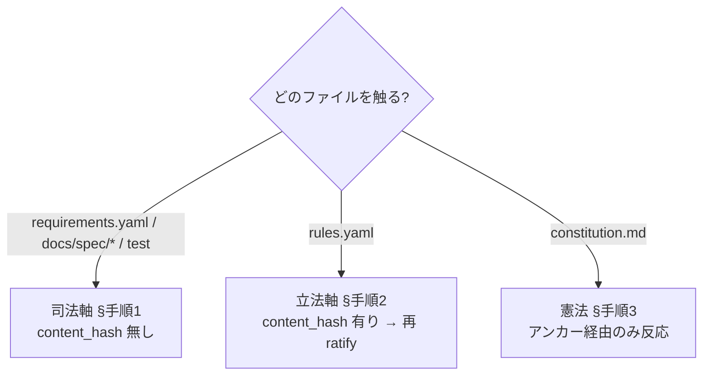

## Context {#context}

warrant 自身が `.warrant/` で warrant を運用している（ドッグフーディング）。仕様を変更するとき、変更者が
**どの軸を触っているかで `warrant check` の反応が根本的に違う**にもかかわらず、その差を意識しない単一手順で
作業すると「機械が止めてくれる」と誤認し、止まらない経路（素通り）を見落とす。

一次情報で確認できる挙動差は次の 3 点。

- 司法軸（`requirements.yaml` ↔ `spec` ↔ test）は `content_hash` を**持たない**。「仕様の本文だけ書き換えても
  `warrant check` は PASS する……決定性ゲートの設計思想からくる意図的な非対応」（`docs/consistency-model.md:147`）。
  機械が捕まえるのは `spec.section` 見出しの消失（`E-SPEC-NOSECTION`）とテストリンク破れ（`E-TEST-NOFILE` /
  `E-TAG-MISSING`）のみ（`docs/consistency-model.md:113-120` 検査表・`:140-144` シナリオA/B）。
- 立法軸（`rules.yaml`）は `content_hash` を**持つ**。正規ハッシュの入力は `id/title/status/basis/scope/enforced_by`
  で、`ratification` ブロックは除外される（`docs/spec/authority.md:54-69`）。本文を変えると `E-RULE-UNRATIFIED` で
  FAIL し、再承認を機械が強制する。
- 憲法（`.warrant/constitution.md`）はハッシュ入力に**直接は含まれない**。`basis` は `constitution.md#anchor` という
  ポインタ文字列であり、「憲法本文だけ書き換えてポインタが変わらなければ hash は反応せず、再 ratify は走らない」
  （`docs/consistency-model.md:180`）。これが最大の盲点。

この挙動差を運用手順に明示しないと、HOTL の人間承認点が機械ゲートの穴と対応せず、監督が名目化する。

## Decision Drivers {#drivers}

- **決定性ゲートの原則を壊さない。** ゲート経路に LLM 推論・時刻・乱数を入れない（`.warrant/constitution.md#determinism`）。
  手順側でこの前提を崩さないこと。
- **素通り経路を取りこぼさない。** 機械が止めない 2 経路（司法軸の本文ドリフト・憲法アンカー据え置き）を、
  手順上の明示チェックポイントに変換する（`enforced_by`・タグ・`governs` の不整合は `E-ENFORCE-TAG-MISSING` /
  `E-CHECK-OUTOFSCOPE` で `warrant check` が機械検知するため、素通りには含めない）。
- **承認の意味を保つ。** ratify は人間の同意の記録に徹し、本文を自動生成・自動昇格しない（`docs/spec/ratify.md:9-10`）。
- **運用負荷を最小化する。** 軸判定の認知コストと、リンク更新の雑用を増やしすぎない。

## Considered Options {#options}

| 判断軸 | A: 統一単一手順 | B: 軸別差別化手順 + HOTL 承認点 [*] | C: 機械ゲート強化（ツール改修） |
|---|---|---|---|
| 素通り経路の被覆 | no | yes | yes |
| 決定性ゲート原則との整合 | yes | yes | yes |
| 承認の意味の保持 | mid | yes | mid |
| 運用・改修コストの低さ | yes | mid | no |
| 説明 | 軸を区別しない 1 手順。学習は容易だが挙動差を隠蔽し、素通り経路が手順から落ちる。 | 各軸の `check` 挙動に手順を対応づけ、機械が止めない箇所を人間承認点で埋める。 | 司法軸にも `content_hash` を導入する等で人間規律を減らす。 |

- **A: 統一単一手順** — 「編集 → `warrant check` → PR」の 1 本に畳む。覚えやすい反面、司法軸に hash が無く立法軸には
  有るという差を隠すため、本文ドリフトと憲法アンカー据え置きが手順の視界から外れる。軸を区別しないと「どこで ratify
  （人間の同意）が必須か」も曖昧になり、承認の意味が薄まる（承認の意味=mid）。却下理由: Driver「素通り経路を
  取りこぼさない」を満たせない。
- **B: 軸別差別化手順 + HOTL 承認点（採用）** — 最初に「どの軸か」を判定し、軸ごとに「機械が止める所／人間が
  引き受ける所」を別建てで定める。素通り経路を各軸の人間チェックポイントに 1 対 1 対応させる。短所: 軸判定の
  認知コストと、人間規律（見出しに値を含める／憲法アンカー改名）への依存が残る。
- **C: 機械ゲート強化** — 要件にも `content_hash` を導入する等で素通りをツールで塞ぐ。`content_hash` は決定論的な
  ハッシュ比較であり `.warrant/constitution.md#determinism`（LLM/時刻/乱数の禁止）には抵触せず（立法軸が既に使用）、
  本文ドリフト（承認後に本文が変わったこと）は機械検知できる。ただし「仕様文の意味とテストの意味が一致するか」は
  原理的に決定論では判定できない（`docs/consistency-model.md:9`）ため意味ドリフトは残り、自動化が進むほど ratify
  （人間の同意）の関与が薄れて承認の意味が弱まる（承認の意味=mid）。却下理由: 決定論とは両立するが、warrant 本体の
  データモデル/ツール改修であり本 ADR の射程（運用手順）外、かつ移行コストが大きい（コストの低さ=no）。

## Decision {#decision}

> [!SUCCESS] 採用：B 案 — 軸別差別化手順 + HOTL 承認点
> 「どの軸を触るか」を最初に判定し、軸ごとに手順を分ける。決め手は **Driver「素通り経路を取りこぼさない」**。
> 機械が止めない 2 経路を、各軸の人間承認点（ratify / CODEOWNERS / レビュー観点）に明示的に割り当てることで、
> HOTL の監督点を機械ゲートの穴と一致させる。warrant 本体のコード改修は伴わない。

最初の分岐は次の 1 問。

要約は次表。各軸の詳細手順を以下に定める。

| 軸 | 編集対象 | `check` の反応 | 人間の承認点 | ratify |
|---|---|---|---|---|
| 司法 | `requirements.yaml` / `spec` / test | section・リンクのみ。**本文は素通り** | `docs/spec/` CODEOWNERS + `@covers` 突合 | 不要 |
| 立法 | `rules.yaml` | 本文変更で `E-RULE-UNRATIFIED` | `/.warrant/` CODEOWNERS + 第二レビュー | **必須** |
| 憲法 | `constitution.md` | **アンカー変更時のみ**。本文は素通り | `/.warrant/`・`/docs/spec/`・`/.github/` CODEOWNERS | 関連ルールで必須 |

### 手順1: 司法軸（要件・仕様・テスト） {#proc-judicial}

`content_hash` が無いため、主眼は**素通り経路（本文ドリフト）を人間規律で塞ぐ**こと。

1. 値が変わるなら `spec.section` の**見出しに値を含めて改名**する（例 `### 失効しきい値: 180日` → `90日`）。
   本文ドリフトを `E-SPEC-NOSECTION` に変換して機械追従を強制する（`docs/consistency-model.md:154`）。
2. spec 本文・テストのアサーション値・`@covers` を更新する。
3. `warrant check`（ローカル）で section 消失・テストリンク破れを検出する。
4. **テストランナーを実行**し、テスト↔実装の挙動追従を検出する（warrant の範囲外。ここが追従の本体）。
5. PR を出す。`docs/spec/` 配下は CODEOWNERS でオーナーレビュー必須。レビュアーが `@covers` と仕様値を突き合わせる。

ratify は不要（要件に hash は無い）。見出しを据え置いて本文だけ変えると `check` は素通りする — これが HOTL における
人間レビューの担当領域。

### 手順2: 立法軸（ルール = `rules.yaml`） {#proc-legislative}

`content_hash` が有るため、本文変更は機械が再承認を強制する。

1. `rules.yaml` のルール本文（`id/title/status/basis/scope/enforced_by`）を編集する。
2. `warrant check` → `E-RULE-UNRATIFIED` で FAIL することを確認する。
3. （任意）`warrant advise` の `proposed_assertion` を参考に本文を仕上げる。ratify は本文を自動生成しない
   （著すのは人間 / `docs/spec/ratify.md:9-10`）。
4. `warrant ratify --rule <ID> --write --approved-by "name@example.com"` でローカル同意を記録する。
   dry-run が既定なので `--write` 必須。`--write` は `--rule` か `--all` のいずれか必須（無指定は exit 2 で拒否 /
   `docs/spec/ratify.md:42-43`）。
5. `warrant check` → PASS を確認する。
6. `enforced_by` を触ったなら、チェックファイル側の `@warrant-enforces <ID>` タグと `governs ⊆ scope` も整合させる
   （`E-ENFORCE-TAG-MISSING` / `E-CHECK-OUTOFSCOPE`）。
7. PR を出す。`/.warrant/` 配下は CODEOWNERS + ブランチ保護で第二の人間レビュー。ここで ratify（ローカル同意）と
   CODEOWNERS（第二レビュー）の両輪で承認ループが閉じる。

### 手順3: 憲法（`constitution.md`） {#proc-constitution}

ハッシュ入力は `basis`（ポインタ文字列）であって憲法本文ではない。**本文だけ変えてアンカーを据え置くと、統治根拠が
変わってもルールが無承認のまま素通りする**（`docs/consistency-model.md:180`）。これを規律で塞ぐ。

1. 節の意味を変えるなら `{#anchor}` も**必ず改名**する（例 `{#determinism}` → `{#determinism-v2}`）。
   アンカー一致条件は本文に `{#anchor}` がリテラルで存在すること（`docs/spec/authority.md:50-52`）。
2. その節を `basis` に持つ**全ルールの `basis` を新アンカーへ更新**する（`rules.yaml`）。これで hash 入力が動く。
3. `warrant check` → 旧アンカー消失で `E-RULE-BASIS-NOANCHOR`、`basis` 変更で `E-RULE-UNRATIFIED`。
   どちらの経路でも再承認が強制される。
4. 各ルールを `warrant ratify --rule <ID> --write` で再同意する。
5. PR を出す。`/.warrant/`・`/docs/spec/`・`/.github/` は CODEOWNERS でオーナーレビュー必須。

アンカーを変えない軽微な文言修正は機械が反応しない。その場合は「根拠の意味は変わっていない」と人間が判断する点で
あり、意味が変わったらアンカーを変える規律で機械検知に変換する。

## Consequences {#consequences}

- **Positive:** 機械が止めない 2 経路（司法軸の本文ドリフト・憲法アンカー据え置き）が手順上の明示チェックポイントに
  なる。`enforced_by`・タグ・`governs` の不整合は `warrant check` が機械検知するので手順では機械側に委ね、人間の承認点
  はこの 2 経路に集中させられる。結果、HOTL の人間レビュー負荷を機械ゲートの穴と過不足なく対応させられる。warrant 本体
  の改修は不要で、既存の `docs/consistency-model.md` の思想を実行手順に落とすだけで成立する。
- **Negative:** 軸ごとに手順が分岐するため、変更者は作業前に「どの軸か」を判定する認知負荷を負う。また
  `spec.section` に値を含める／憲法アンカーを改名するという**人間規律に依存**し、規律が破れれば素通りは戻る
  （機械保証ではない）。憲法の軽微修正で「意味が変わったか」の判断は依然レビュアーの主観に残る。
- **Neutral:** 立法軸の承認ループ（ratify + CODEOWNERS）は既存仕様どおりで、本 ADR で挙動を変えない。司法軸とテスト
  ランナー・人間レビューの三者分業（`docs/consistency-model.md` 中心思想）も変えず、その分業を前提に手順を整理した。

## Compliance & Monitoring {#compliance}

HOTL は「自動ゲート + 人間の監督」の両輪で初めて成立する。コードに含められないサーバ側設定が前提条件
（`README.md:283-290`）。

- (a) `master` への直接 push を禁止し PR 経由を必須化する
- (b) マージ前に PR レビュー承認を必須化する
- (c) "Require review from Code Owners" を有効化する（`/.warrant/`・`/docs/spec/`・`/.github/` に適用）
- (d) `warrant check` を実行する CI（`.github/workflows/governance.yml` に実在）を**必須ステータスチェック**に指定する

CI ワークフロー自体はリポジトリに存在する（`.github/workflows/governance.yml` が `./warrant check` を実行）が、それを
マージの**必須ステータスチェック**にする設定はサーバ側（GitHub 設定画面）の手動作業でリポジトリのコードには含められない。
本 ADR は HOTL の前提（lead 参照）として (d) を**必須**とする立場を採る。README の同節も (d) を必須として同期する。

監視: 立法軸のルール本文変更と、憲法のアンカー/`basis` を変更した場合は `warrant check`（CI）が機械的に落とす
（`E-RULE-UNRATIFIED` / `E-RULE-BASIS-NOANCHOR`）。一方、司法軸の本文ドリフトと、憲法本文だけ変えてアンカーを据え置いた
場合（Context・手順3 で述べた「最大の盲点」）は機械では落ちないため、PR レビューでの `@covers` 突合・「意味変更なら
アンカー改名」の確認とテストランナーの失敗が観測点になる。後述の反証トリガーは、この人間依存部分が破れた回数を観測して
手順または方針の見直しに繋げるためのもの。

## 反証：この決定が間違いになるとしたら {#falsification}

> [!WARNING] この決定が間違いになるとしたら、何が原因か
> 本方針は「軸の差を人間が理解し、規律を守る」前提に立つ。前提が崩れる観測可能なトリガー:
> - **司法軸の本文ドリフトがレビューをすり抜けた事例が四半期に 2 回以上**観測されたら → 人間規律が機能していない。
>   C 案（要件への `content_hash` 導入等のツール改修）を再検討する。
> - **憲法アンカー改名の忘れによる無承認すり抜け**が 1 回でも観測されたら（盲点が現実化）→ `basis` 解決時に
>   憲法本文ハッシュも入力に含める warrant 改修を検討する。
> - **「どの軸か」の判定ミスによる手順誤適用**が複数回観測されたら → 軸判定を補助するツール化（lint や PR ボット）を
>   検討する。手順を覚える前提自体が重すぎるサイン。
> - 軸を分けても運用が回らず、変更のたびに「結局どうするのか」の質問が**月 3 回以上**出るなら → 軸別差別化（B）が
>   過剰設計だった可能性。A（統一手順）+ チェックリスト 1 枚に畳み直す。

## References {#references}

- `docs/consistency-model.md` — 整合性モデルと三者分業。素通り経路（`:147`）・改修シナリオ（`:122-147`）・
  憲法アンカーの盲点（`:180`）・運用ガイドライン（`:188-193`）の一次情報。
- `docs/spec/authority.md` — 立法軸の不変条件、`content_hash` 正規化（`:54-69`）、basis アンカー形式（`:50-52`）。
- `docs/spec/ratify.md` — ratify の役割・非役割（`:9-10`）と不変条件（dry-run 既定 / `--write` 対象必須 `:42-43`）。
- `.warrant/constitution.md` — 決定性ゲートの原則（`#determinism`）。
- `README.md` — 承認の二重化とブランチ保護の必須設定（`:277-290`）。
